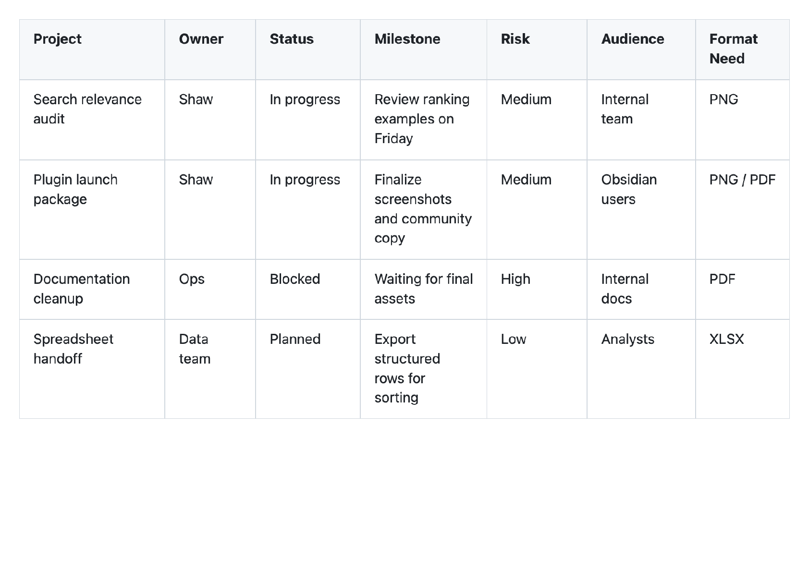
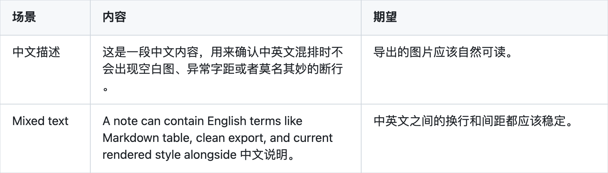
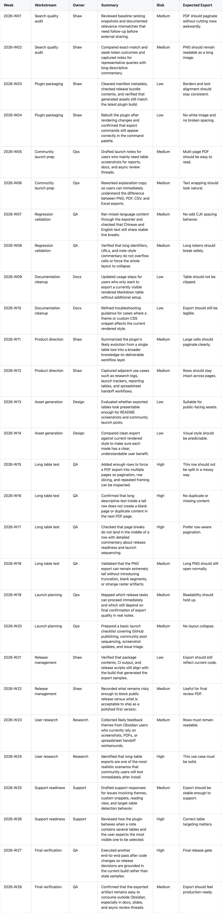

# Obsidian Table Exporter

[English](README.md) | [简体中文](README.zh-CN.md)

[](https://github.com/wikty/obsidian-table-exporter/releases)
[](https://github.com/wikty/obsidian-table-exporter/actions/workflows/ci.yml)
[](LICENSE)

Export rendered Markdown tables in Obsidian to `PNG`, `CSV`, `Excel (.xlsx)`, and `PDF`.

`Obsidian Table Exporter` is for the moment when a table already looks right in Obsidian, but getting it out into a clean, reusable format is still awkward. It works from the rendered table in the active note, so image and PDF exports stay much closer to what you actually see in reading view.

## Contents

- [Why people use it](#why-people-use-it)
- [Preview](#preview)
- [Quick start](#quick-start)
- [Features](#features)
- [Installation](#installation)
- [Development](#development)
- [Troubleshooting](#troubleshooting)
- [Limitations](#limitations)

## Why people use it

- Turn a long rendered table into a clean image without stitching screenshots
- Export table data to `CSV` or `Excel` without rebuilding it by hand
- Share a paginated `PDF` without relying on the default print flow
- Prefer the table you just hovered or clicked when a note contains several tables

## Preview

### Wide table exported as PDF

Useful when the table is better reviewed as a document than as a pasted image.



### Mixed-language content

The exporter is designed to stay readable when a table mixes English and Chinese content.



<details>
<summary>Long PNG export preview</summary>

Long status tables and research logs are the cases where manual screenshots usually become painful.



</details>

## Quick start

1. Open a note in reading view or live preview.
2. Put the pointer over the table you want to export.
3. Run `Table Exporter: Export Markdown table as PNG`, `CSV`, `Excel`, or `PDF`.
4. For `PNG` and `PDF`, adjust the per-run export options if needed.
5. Grab the result from your vault's export folder.

## Features

- Export rendered Markdown tables as `PNG`
- Export table data as `CSV`
- Export table data as `Excel (.xlsx)`
- Export rendered Markdown tables as paginated `PDF`
- Choose between a `clean export` style and the current rendered Obsidian style
- Tune export options per run instead of changing global settings every time
- Copy exported `PNG` files directly to the clipboard
- Reveal exported files in Finder or open them immediately after export
- Auto-detect multiple tables in the active note
- Prefer the table you most recently hovered or clicked
- Save exports directly into a configurable folder inside the vault

## Best use cases

- Product specs, research notes, and comparison grids you want to share as images
- Markdown tables that need to move into `Excel` or `Google Sheets`
- Long tables that break under Obsidian's normal print-to-PDF flow
- Notes with multiple tables where you want the export command to prefer the one you just touched

## Commands

- `Export Markdown table`
- `Export Markdown table as PNG`
- `Export Markdown table as PNG and copy to clipboard`
- `Export Markdown table as CSV`
- `Export Markdown table as Excel`
- `Export Markdown table as PDF`

## Settings

- `Export folder`: vault folder where generated files are written
- `Image scale`: controls PNG/PDF sharpness
- `Image background`: background color for image-based exports
- `Default visual style`: choose between cleaned-up export styling and the current rendered look
- `Default post-export action`: do nothing, reveal in Finder, or open the exported file
- `Default copy PNG to clipboard`: opt into clipboard-friendly PNG exports
- `PNG filename template`: supports `{{note}}` and `{{index}}`
- `CSV delimiter`: comma, semicolon, or tab
- `PDF page size`: `A4` or `Letter`
- `PDF orientation`: portrait or landscape
- `PDF margin`: page margin for image-based PDF exports

## Export options dialog

`PNG` and `PDF` exports open a per-run options dialog so you can tweak output without changing plugin defaults.

- `Visual style`: `Clean export` normalizes fonts, removes inline-code styling, and strips Obsidian-only highlight artifacts. `Current rendered style` stays closer to what you see in the note.
- `Scale`: controls image sharpness for `PNG` and image-based `PDF`.
- `Background`: sets the exported background color.
- `PDF page size`, `orientation`, and `margin`: adjust PDF pagination behavior.
- `After export`: optionally reveal the saved file in Finder or open it immediately.
- `Copy PNG to clipboard`: available for PNG exports and also exposed as a dedicated command.

## Installation

### Local install

1. Build the plugin:

```bash
npm install
npm run build
```

2. Copy these files into your vault plugin folder:

- `main.js`
- `manifest.json`
- `styles.css`

Target folder:

```text
<your-vault>/.obsidian/plugins/table-exporter/
```

3. In Obsidian:

- Open `Settings -> Community plugins`
- Reload community plugins if needed
- Enable `Table Exporter`

### Release package

Prebuilt release assets are available on the [GitHub Releases page](https://github.com/wikty/obsidian-table-exporter/releases).

## Development

```bash
npm install
npm run dev
```

Other checks:

```bash
npm run check
npm test
npm run build
npm run release:check
npm run package
```

Project maintenance docs:

- `CHANGELOG.md`
- `CONTRIBUTING.md`
- `CODE_OF_CONDUCT.md`
- `RELEASE_CHECKLIST.md`
- `SECURITY.md`

## Troubleshooting

- `PNG` or `PDF` looks blank
  Use the latest build. Older builds had a cloned-DOM rendering issue that could produce white exports.
- `The wrong table was exported`
  Hover or click the table first, then run the command again.
- `The table still looks too much like Obsidian`
  Switch to `Clean export` in the export dialog.
- `The PDF is too cramped`
  Increase `Margin`, switch orientation, or use a higher `Scale`.
- `I need selectable text in PDF`
  That is not supported yet. Current PDF export is image-based by design.

## Technical approach

- Table discovery uses the active `MarkdownView` and scans rendered preview tables.
- Visual exports use a hybrid pipeline:
  `clean export` renders a normalized SVG/HTML representation for more predictable output, while `current rendered style` captures the live DOM with `html2canvas`.
- `PDF` export uses row-aware pagination so long tables break on row boundaries instead of arbitrary pixel cuts whenever possible.
- Data exports use normalized table matrices so `colspan` and `rowspan` do not break the output shape.

## Limitations

- The plugin currently works with rendered tables in reading/preview mode, not raw source-mode text selections.
- `PDF` export is image-based, so text in the PDF is not selectable yet.
- Extremely large tables may still be constrained by browser canvas memory limits.
- Formula support for Excel export is not included in this initial version.

## Roadmap ideas

- Export just the current text selection when it contains a table
- Per-export dialog with filename overrides
- Optional HTML export
- Better handling for nested Markdown inside cells
- Selectable-text PDF generation

## Links

- Repository: [github.com/wikty/obsidian-table-exporter](https://github.com/wikty/obsidian-table-exporter)
- Issues: [github.com/wikty/obsidian-table-exporter/issues](https://github.com/wikty/obsidian-table-exporter/issues)
- Releases: [github.com/wikty/obsidian-table-exporter/releases](https://github.com/wikty/obsidian-table-exporter/releases)

## License

MIT
