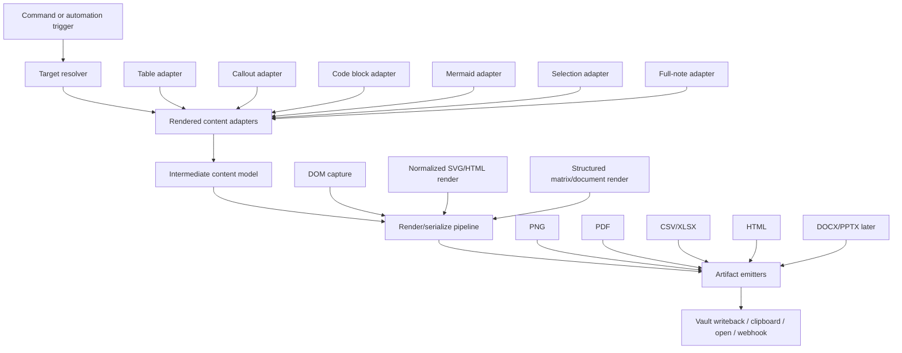

# From Table Exporter to a General Obsidian Export Framework

This document sketches how `Obsidian Table Exporter` could evolve from a focused utility into a broader export framework for rendered knowledge content.

## The larger problem

`Table Exporter` solves a very specific pain point:

> A table already looks right in Obsidian, but getting it out into a usable external format is awkward.

That pain point generalizes quickly.

In practice, many Obsidian users want to move rendered note content into artifacts they can:

- share in chat tools
- send in email
- attach to reports
- paste into documents and slides
- hand off to spreadsheets
- archive as PDFs
- automate into downstream systems

So the bigger product question becomes:

> How do we turn rendered Obsidian knowledge into stable external deliverables?

## Why tables are a strong starting point

Tables are a good first wedge because they force the framework to handle several hard problems early:

- DOM target selection
- structure extraction
- merged-cell normalization
- visual fidelity
- wide layout handling
- long-content pagination
- multiple output formats

A system that works well for tables is already learning the right abstractions for broader export work.

## The framework direction

The next-stage product should not be “a bigger table exporter.”

It should be a general export layer with three separable concerns:

1. target resolution
2. content normalization
3. artifact emission

## Proposed architecture

## Recommended internal layers

### 1. Target resolver layer

Responsibility:

- identify what the user means to export

Examples:

- current table
- selected block
- visible callout
- code block under cursor
- entire note
- a canvas region

Why this deserves its own layer:

- “what should be exported?” is often harder than “how do we render it?”
- different note types and UI states change the answer
- this same problem will recur for every future content type

### 2. Content adapter layer

Responsibility:

- convert rendered Obsidian content into a normalized internal model

Examples of adapters:

- table adapter
- callout adapter
- checklist adapter
- code block adapter
- Mermaid diagram adapter
- embedded search/base view adapter

This layer should preserve both:

- structural meaning
- visual cues worth carrying into export

### 3. Intermediate content model

Responsibility:

- serve as the stable internal representation between Obsidian-specific extraction and output-specific rendering

For tables, today’s `TableData` is an early form of that idea.

A future generalized model likely needs:

- block identity
- content type
- text payload
- structured payload
- layout hints
- render hints
- style intent
- pagination hints

This is the most important long-term design pivot. Once the model is stable, more input adapters and output emitters become much cheaper.

### 4. Rendering and serialization layer

Responsibility:

- choose the right transformation path per target and output format

Possible render paths:

- DOM capture for “what I see now”
- normalized SVG/HTML for stable clean export
- structured serializer for spreadsheet-like outputs
- document compositor for PDF, DOCX, or PPTX

The table exporter already proved that no single render path is sufficient for all fidelity and stability requirements.

### 5. Artifact emitter layer

Responsibility:

- encode and write concrete output artifacts

Examples:

- PNG
- PDF
- CSV
- XLSX
- HTML
- DOCX
- PPTX
- clipboard payloads
- webhook/API payloads

This layer should be intentionally dumb about Obsidian. Ideally it works from normalized export requests and only cares about artifact semantics.

## Product expansion path

The best expansion path is to grow around adjacent user jobs, not just around file formats.

### Phase 1: strengthen the table/export core

Focus:

- HTML export
- filename overrides
- more stable current-style rendering
- richer PDF capabilities
- better regression tooling

Why:

- it strengthens the architecture before widening scope
- it keeps the product story simple while usage signals arrive

### Phase 2: add nearby rendered targets

Best candidates:

- callouts
- code blocks
- selected rendered blocks
- Mermaid diagrams

Why these next:

- they are common in real notes
- they have strong share/export use cases
- they stress different parts of the same architecture

### Phase 3: note-level deliverables

Focus:

- export a whole note section as a polished image or PDF
- export multiple blocks as a report bundle
- support branded templates

This is the point where the product starts shifting from “export helper” to “deliverable generator.”

### Phase 4: automation and team workflows

Focus:

- batch export from folders
- automatic export on note changes
- push exported artifacts to Slack, email, or storage
- shared export presets for teams

This is where the strongest commercial potential starts to appear.

## What must stay true architecturally

As the framework expands, several constraints should remain explicit.

### Rendered-first, not Markdown-only

Users often care about how the content actually appears in Obsidian, not only how the source Markdown parses.

That means the framework should continue to support:

- rendered DOM extraction
- style-aware export
- normalized “clean” export when live styling is too noisy

### Hybrid rendering, not one engine for everything

The table exporter already exposed why single-engine thinking is fragile.

A robust framework should assume:

- some targets work best via DOM capture
- some work best via normalized vector layout
- some work best via structured serialization

### Intermediate models over direct format branching

If every content type exports directly to every format, complexity explodes.

The scalable path is:

1. extract to an intermediate model
2. transform through shared rendering/serialization stages
3. emit target formats

### Regression harness from the start

Future expansion will otherwise repeat the same instability cycle.

The framework should keep a regression set across:

- wide content
- long content
- mixed-language content
- code-like tokens
- multiple export targets in one note
- theme-sensitive styling

## The practical opportunity

If `Table Exporter` stays a single-purpose plugin, it can still be useful.

If it evolves into a more general export framework, it can become the infrastructure for:

- sharing knowledge cleanly
- turning notes into deliverables
- handing content off across tools
- automating publication and reporting workflows

That is a meaningfully larger product surface.

## Suggested next engineering steps

1. Keep `Table Exporter` stable as the first production-grade adapter.
2. Extract a clearer internal “target -> model -> artifact” architecture from the current code.
3. Add one adjacent target type, preferably `callout` or `selected block`.
4. Introduce HTML export to validate a more generic layout pipeline.
5. Build a reusable regression harness before broadening to many new targets.

## Suggested next product steps

1. Launch `Table Exporter` and collect real demand signals.
2. Watch for neighboring requests, especially:
   - export selected block
   - export callout
   - export whole note section
   - better PDF shareability
3. Use those signals to decide whether the next product should remain a plugin utility or become a larger `Obsidian export` product line.
