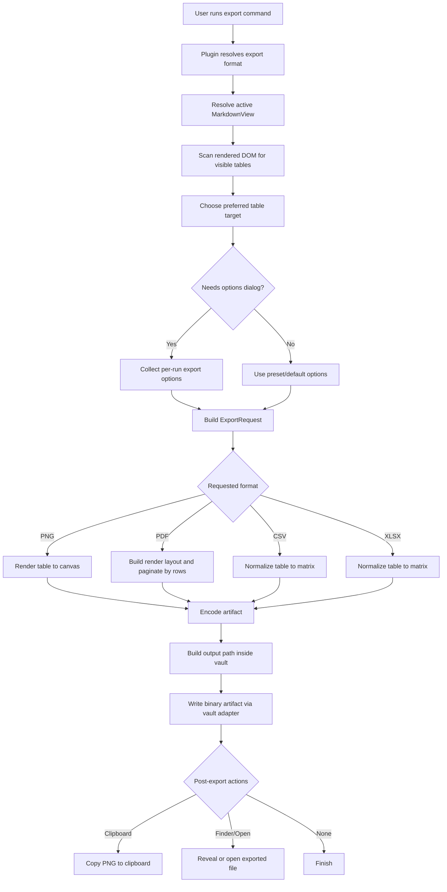

# Table Exporter Implementation Flow

This document explains how a rendered Markdown table moves through the plugin from user intent to exported artifact.

## High-level flow

## Detailed pipeline

### 1. Command entry and format selection

`src/main.ts` registers:

- a generic `Export Markdown table` command
- direct format-specific commands
- a PNG + clipboard shortcut command

The generic command opens a format chooser first. The format-specific commands skip that step and go straight into target resolution.

### 2. Table tracking and target resolution

The plugin does not export “any table in the note.” It tries to export the table the user most likely intended.

Inputs used for target selection:

- the active `MarkdownView`
- rendered table DOM nodes gathered by `getRenderedTables`
- the last hovered or clicked table
- the most visible table in the current viewport

This matters because notes can contain:

- multiple tables
- reading view and live preview render variants
- partially visible long notes

The selection strategy is:

1. Find all visible rendered tables in the active note.
2. Prefer a recently interacted table when that interaction is still fresh.
3. If the remembered table is stale or clearly less relevant than the currently visible one, prefer the most visible table.
4. If there is still ambiguity, fall back to a selection modal.

This targeting logic is one of the most important product decisions in the plugin, because a technically correct export of the wrong table is still a user-facing failure.

### 3. Extracting structured table data

Each visible DOM table is converted into `TableData`.

Captured fields include:

- note path
- table index inside the note
- row and column counts
- cell text
- cell HTML
- `rowspan` and `colspan`
- header-cell status

The DOM extraction layer is intentionally lightweight. It preserves enough structure to drive:

- matrix-based data export
- title generation
- layout-aware visual export

### 4. Option resolution

Before export, the plugin resolves export options from one of two places:

- per-run modal input
- defaults from plugin settings

The important options today are:

- visual style: `clean` or `current`
- render engine: `auto`, `svg`, or `dom`
- image scale
- background color
- PDF page size, orientation, and margin
- post-export action
- copy-PNG-to-clipboard toggle

This separation keeps defaults stable while still allowing users to adapt output for a particular note.

### 5. Format dispatch

The exporter layer branches into two broad categories.

#### Data export

`CSV` and `XLSX` work from a normalized table matrix.

Pipeline:

1. Expand `rowspan` and `colspan` into a grid shape.
2. Fill continuation cells with empty strings so output width stays rectangular.
3. Serialize to `CSV` or map into workbook rows for `XLSX`.

This avoids common output-shape bugs where merged cells create jagged spreadsheets.

#### Visual export

`PNG` and `PDF` work from the rendered table plus a visual rendering strategy.

Pipeline:

1. Resolve render engine.
2. Render to canvas.
3. Encode canvas as PNG or paginate it into PDF pages.

### 6. Rendering strategy

The plugin currently uses a hybrid visual pipeline.

#### DOM capture path

Used primarily for `current rendered style`.

- Clone the rendered table into an isolated wrapper.
- Sync computed styles.
- Render with `html2canvas`.

This path stays closer to what the user saw in Obsidian, but it inherits more runtime-specific rendering risk.

#### SVG layout path

Used primarily for `clean export`.

- Convert table data into a normalized matrix.
- Estimate column widths.
- Measure row heights.
- Build a deterministic SVG table layout.
- Rasterize SVG into a canvas.

This path is more predictable, especially for:

- long exports
- wide tables
- mixed-language content
- “clean” output that should avoid Obsidian-specific styling artifacts

### 7. PDF pagination

PDF export is not just “take the PNG and slice it blindly.”

The plugin first builds a logical table layout with row heights, then paginates by row boundaries whenever possible:

1. Compute logical table width and row heights.
2. Translate PDF page size and margins into usable logical height.
3. Keep the header row on each page.
4. Accumulate body rows until the next row would exceed the page.
5. Render a page-specific layout.
6. Only fall back to image slicing if a rendered page still exceeds the physical page constraints.

This is the difference between:

- a readable multi-page export
- an arbitrary pixel-cut document

### 8. Artifact writeback

After encoding the artifact, the plugin:

1. Builds the filename from note title and table index.
2. Resolves the export path inside the configured vault folder.
3. Writes binary data through the Obsidian vault adapter.
4. Optionally copies PNG output to the clipboard.
5. Optionally reveals or opens the file.
6. Raises a success or error notice.

## Where the key responsibilities live

- `src/main.ts`
  Command flow, target resolution, option flow, writeback, and post-export actions.
- `src/table-dom.ts`
  Rendered table discovery and DOM extraction.
- `src/table-model.ts`
  Matrix normalization for merged cells.
- `src/exporters/render.ts`
  Visual render engines, layout, and pagination primitives.
- `src/exporters/png.ts`
  PNG-specific artifact generation.
- `src/exporters/pdf.ts`
  PDF pagination and final document generation.
- `src/exporters/csv.ts`
  CSV serialization.
- `src/exporters/xlsx.ts`
  Excel workbook generation.

## Why this flow matters for future work

This plugin already demonstrates a reusable export architecture pattern:

1. identify the rendered target
2. capture structured content plus visual intent
3. choose a format-specific rendering path
4. normalize for stability
5. emit an external artifact

That pattern is broader than tables, and it is the foundation for a more general Obsidian export framework.
